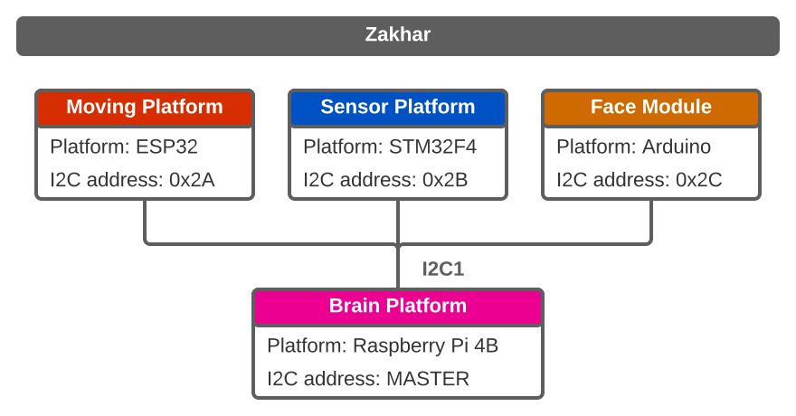
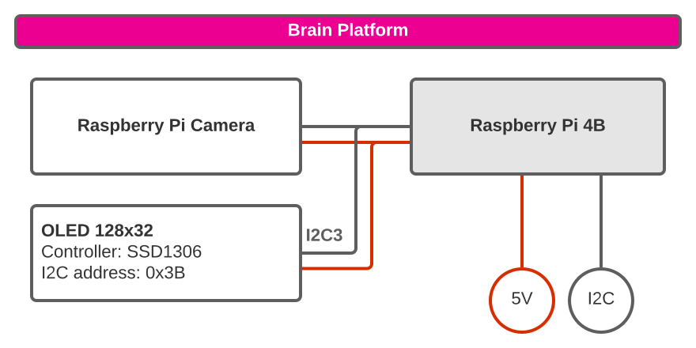
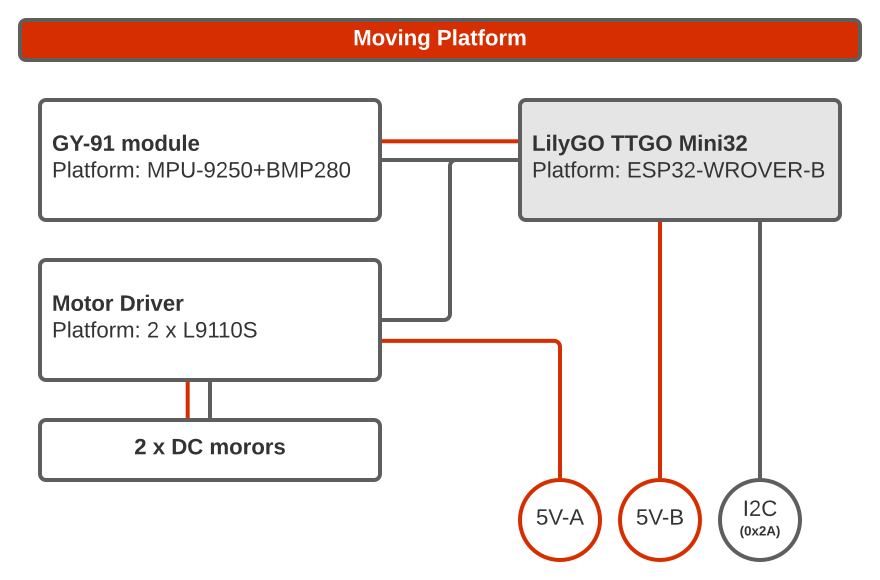
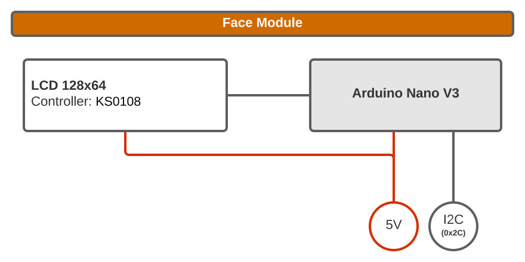
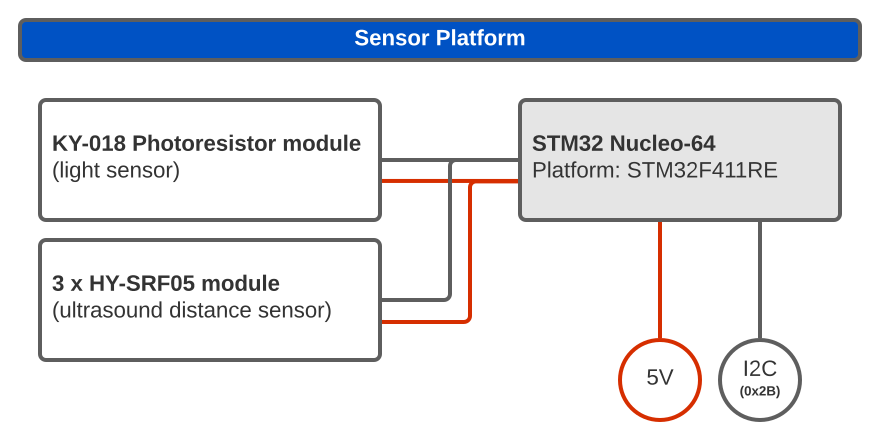
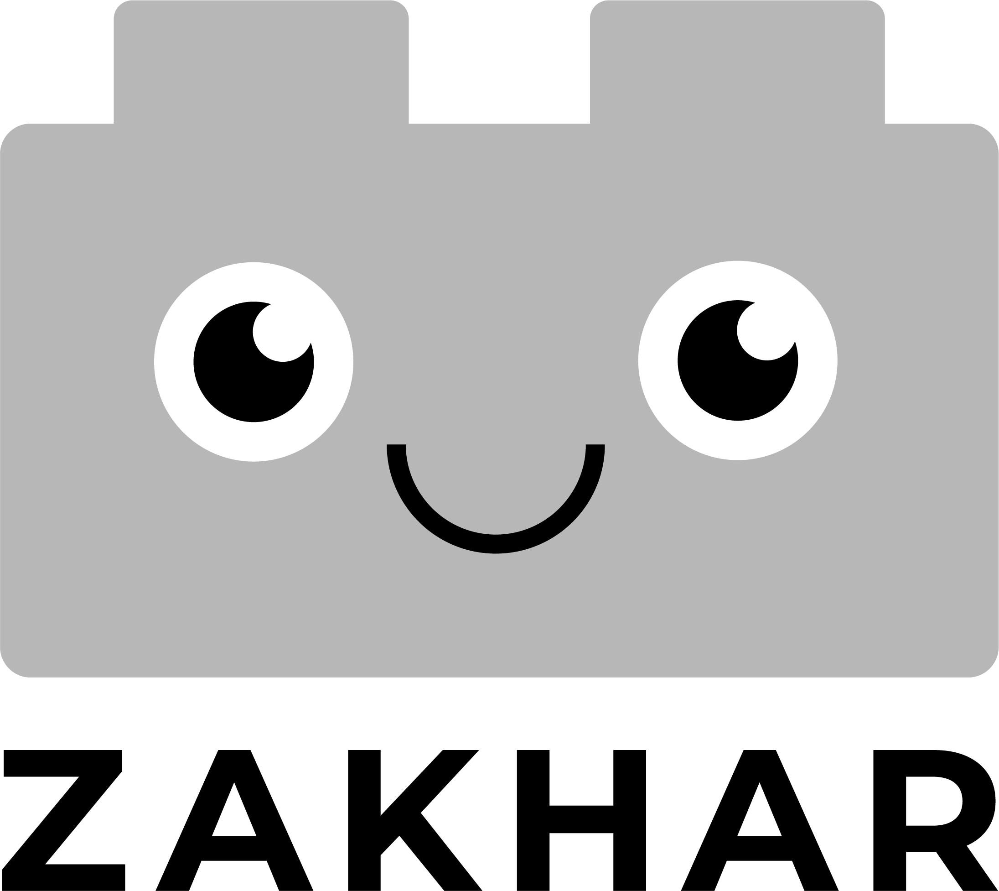

# The Zakhar Project

## About

Zakhar is a robotics UX project. The main aim is to decrease the anxiety of users interacting with a robot.

**Assumed**: that the humans can interact the most effective and seamless with other living creatures

**Suggested**: to develop a robot's program structure in the way when basics of its logic are understandable from the robot's behavior. The behavior should mimic the animal one (as the human is an animal too).

Suggested to split the program into three parts:

- Conscious
- Unconscious
- Reflexes

**Conscious** represents simple intentions: move forward, sleep, run away, search something, etc.

**Unconscious** is responsible to solve how to realize those intentions: what to do for moving, how to behave if looking something etc.

**Reflexes** are small algorithms that can monopolize Unconscious from Conscious in some very explicit situations. E.g. panic and fear if something breaking, convulsions if robot stuck and can't move as the conscious tells.

## Structure

### Hardware

Zakhar consists of 4 devices:

- Brain Platform ([source](https://github.com/an-dr/zakhar_brain))
- Face Module ([source](https://github.com/an-dr/zakhar-face-module))
- Moving Platform ([source](https://github.com/an-dr/zakhar_platform))
- Sensor Platform ([source](https://github.com/an-dr/zakhar_sensors))

Each platform has it's own battery and can work standalone. It's structures are represented on pictures bellow.

### Repositories

The hugest parts of the project called gears. Currently there are 3 gears that divided into smaller parts:

- [zakhar_io](https://github.com/an-dr/zakhar_io) - interaction
    - [zakhar-face-module: Zakhar's part which is responsible for facial expressions](https://github.com/an-dr/zakhar-face-module)
    - [zakhar_sensors: Sensors implementation for the Zakhar Project](https://github.com/an-dr/zakhar_sensors)
- [zakhar_brain](https://github.com/an-dr/zakhar_brain) - thinking
    - [zakharos_core: Software core (ROS-based) for the Zakhar project](https://github.com/an-dr/zakharos_core)
    - [zakhar_pycore: Base python package for the Zakhar project](https://github.com/an-dr/zakhar_pycore)
    - [zakhar_service: Software for service purposes](https://github.com/an-dr/zakhar_service)
- [zakhar_platform](https://github.com/an-dr/zakhar_platform) - moving (ESP32-powered motorized platform)

Other related repositories:

- [zakhar_docker: Docker files with Zakhar environment](https://github.com/an-dr/zakhar_docker)
- [zakhar_faces: Zakhar's facial expressions](https://github.com/an-dr/zakhar_faces)
- [zakhar_kicadlib: Library with components for Zakhar project](https://github.com/an-dr/zakhar_kicadlib)
- [zakhar_proto: Repository for experiments and prototyping. Part of the Zakhar project](https://github.com/an-dr/zakhar_proto)
- [r_giskard: Small project for experiments with unconditioned and conditioned reflexes](https://github.com/an-dr/r_giskard)

## Internal standards

- [I2C devices](docs/devices.md)
- [ZakharI2C standard](docs/i2c.md)

## Related articles

- [2020/05/29 - Robot with the Conscious: Imitating animal behavior for reducing user’s anxiety - technical_](https://blog.agramakov.me/2020/05/29/robot-with-the-conscious/)
- [2019/06/01 - Zakhar’s Concept – technical_](https://blog.agramakov.me/2019/06/01/zakhars-concept/)
- [2019/05/05 - Zakhar relaunch: Zakha_ros – technical_](https://blog.agramakov.me/2019/05/05/zakhar-relaunch-zakha_ros/)
- [2019/01/10 - Zakhar the Robot – technical_](https://blog.agramakov.me/2019/01/10/zakhar-the-robot/)

## Milestones

There are two types of milestones, with and without demonstration. Demonstrations intended to show important to the project features followed by an article, milestones without demonstrations mainly focused on technical part of the project

1. ✅ [Reptile Demo](https://github.com/an-dr/zakhar/releases/tag/reptile_demo) - implementing of a simple reptile instinct
    - Article: [Robot with the Conscious: Imitating animal behavior for reducing user’s anxiety](https://blog.agramakov.me/2020/05/29/robot-with-the-conscious/)
2. ✅ [Zakharos](https://github.com/an-dr/zakhar/releases/tag/zakharos) - moving the core to the [ROS](https://www.ros.org/)
3. 🟧 Emotions Demo - emotions and reflexes
4. ⬜ ZakhaR.Giskard (Note: R.Giskard is a robot from novels by I.Asimov which could control human's emotions) - Further development of using conditioned and unconditioned responses
5. ⬜ Animal Demo - showing the robot to users and collecting responses for making conclusions of this iteration

[Details...](docs/future.md)

## License

This work is licensed under the terms of the GPLv3 license.

For a copy, see: [LICENSE](LICENSE)

- site:    https://agramakov.me
- e-mail:  mail@agramakov.me

## Support

If you will decide to support me, you can send some pretty words on my email or just use the link

Any amount will motivate me to develop the project. Thanks in advance!

## Links

- [Main project's page (on hackaday.io)](http://zakhar.agramakov.me/)
- [Instagram](https://www.instagram.com/zakhar_the_robot/)
- [Project's how-to on hackster.io (WIP)](https://www.hackster.io/an-dr/zakhar-the-robot-0d8744)
