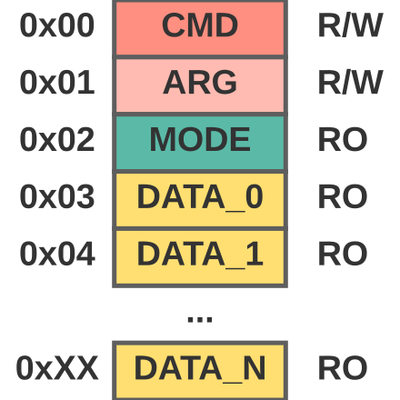
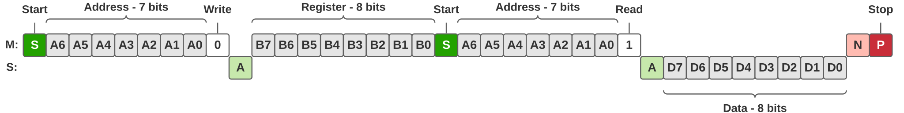
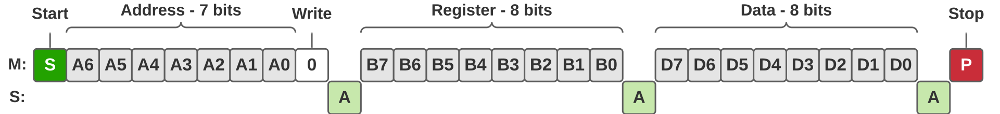
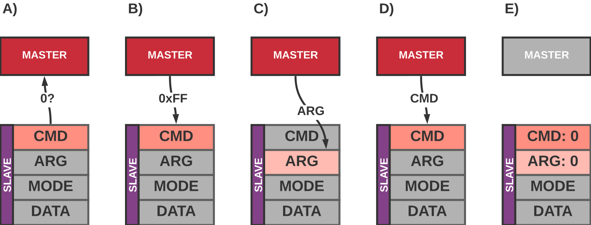

# ZakharI2C

[Back to README](../README.md)

This file describes I2C communication used by Zakhar's systems

## Basic description

- Standard uses 7-bit addressing.
- Devices can have data located in 0x02...0xFE registers - 253 bytes
- Each device mandatorily has registers 0x00 to store command, 0x01 for arguments, and 0x02 to store device state.
- Commands should be represented by values 0x01...0xFE
- Read and write operations are described bellow

## Registers

Minimal register map:

- `REG_CMD` - Command register. The device is reading commands from here
- `REG_ARG` - Optional argument of the command
- `REG_MODE` - Mode register. If device support working in several modes, this register should be used to indicate it.
- other addresses can be used for device specific data

## Read/Write operations

To read master should consequently:

- Send Start state
- Send Write command
- Send Register number
- Send Start state
- Send Read command
- Read byte(s)
- Send NACK
- Send Stop state

Then read one byte - the value from the register

To write data master should consequently:

- Send Start state
- Send Write command
- Send Register number
- Send Data byte(s)
- Send Stop state

## Command writing process

### Full process

- A) Master read the `REG_CMD` register. If it is not 0x00 - slave should be considered as busy.
- B) If slave is not busy Master writes `0xFF` to `REG_CMD`
- C) Optionally write argument to `REG_ARG`
- D) Master writes a command to the `REG_CMD` (command is any value in the range `0x01`...`0xFE`)
- E) When the command is executed, slave sets CMD and ARG registers to 0x00

### Simplified process

- A) (optionally) Write an argument to `REG_ARG`
- B) Write a command to `REG_CMD`
